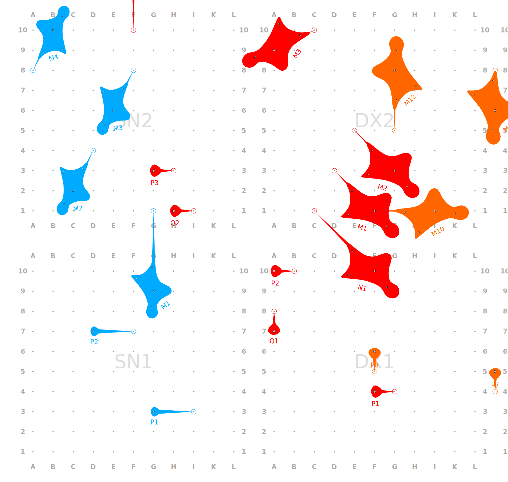
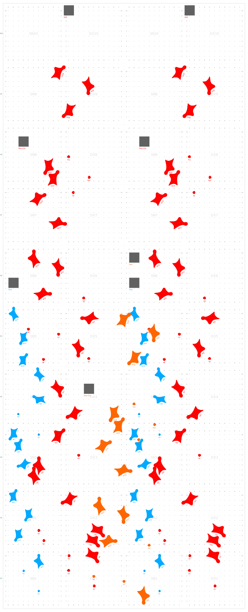
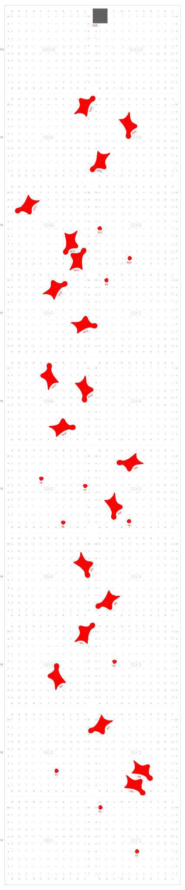
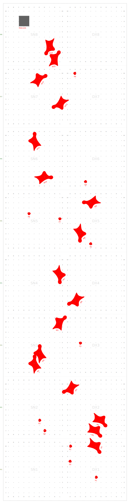
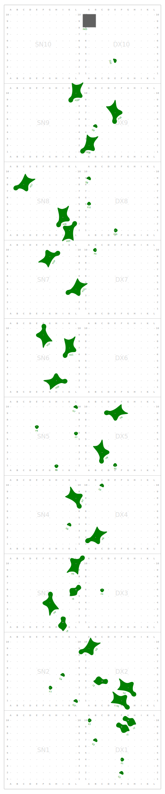
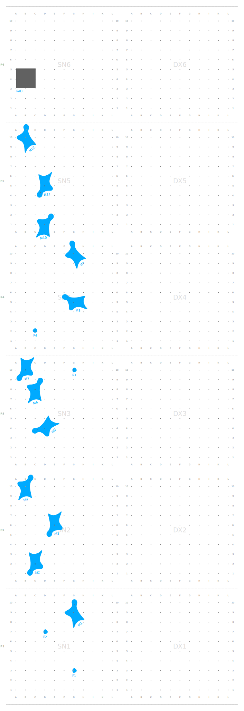
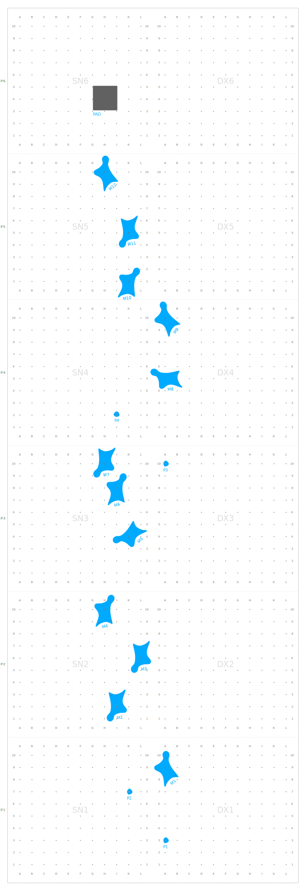

# Speed Wall Visualizer

Outil de visualisation et de configuration pour murs de vitesse d'escalade. Permet de générer des SVG représentant le placement des prises sur un mur selon différentes voies de référence (IFSC, catégories jeunes, etc.).

**[Accéder à l'application](https://configurateur-voies-vitesse.al-escalade.fr/)**

## Fonctionnalités

### Application web

- **Configurateur visuel** : Interface intuitive pour créer et modifier des configurations de mur
- **Gestion des configurations** : Créer, renommer, supprimer des configurations multiples
- **Sections personnalisables** :
  - Choix de la voie source (IFSC, U15, U11-U13, etc.)
  - Sélection du couloir (0 à n)
  - Plage de prises personnalisable (de/à)
  - Couleur personnalisée par section
  - Point d'ancrage ajustable
- **Options d'affichage** : Couleur de grille, taille des labels, flèches d'orientation

### Export et partage

- **Export JSON** : Sauvegarde/restauration des configurations
- **Export SVG** : Téléchargement du rendu vectoriel
- **Export PDF multi-pages** : Impression grand format avec chevauchement configurable
  - Mode mur complet ou couloir par couloir
  - Orientation portrait/paysage
  - Aperçu des pages avant export
- **Partage par URL** : Génération de liens partageables

### Support mobile

- **Interface responsive** : Navigation par onglets sur mobile
- **Gestes tactiles** :
  - Glisser à un doigt pour naviguer
  - Pinch pour zoomer
  - Double-tap pour réinitialiser la vue

## Exemples de rendus

### Flèches d'orientation

Visualisation des flèches indiquant l'orientation des prises.



### Configuration 2 voies complètes + section de fin

Les 2 voies complètes U15 sont sur le mur, ainsi que 2 voies complètes U11/U13. Entre les 2 couloirs, la section de fin de la voie U15 et plus est ajoutée.



### Voie IFSC officielle



### Voie U15 (FFME)



### Voie U15 (Italie/Allemagne/Suisse)



### Voie U11-U13 (FFME - entraînement)



### Voie U11-U13 (FFME - compétition)



### Voie U13 (Allemagne/Suisse) - 10m


## Voies de référence disponibles

- `ifsc` : Voie officielle IFSC
- `u15` : Catégorie U15 (FFME)
- `u11-u13` : Catégorie U11-U13 (FFME - entraînement)
- `u11-u13-comp` : Catégorie U11-U13 (FFME - compétition)
- `u15-it` : Catégorie U15 (Italie/Allemagne/Suisse)
- `u13-de` : Catégorie U13 (Allemagne/Suisse) - 10m
- `training` : Combinaison voie U15 et IFSC

## Développement

### Installation

```bash
npm install
npm run build
```

### Lancer l'application web en développement

```bash
npm run dev
```

### Générer un SVG via CLI

```bash
npm run generate -- -c data/base.json -o output/wall.svg
```

Options :
- `-c, --config <path>` : Fichier de configuration JSON
- `-o, --output <path>` : Fichier SVG de sortie

### Configuration JSON

Le fichier de configuration définit :
- Les dimensions du mur (nombre de couloirs, hauteur en panneaux)
- Les voies à afficher avec leurs segments

Exemple :
```json
{
  "wall": {
    "lanes": 2,
    "panelsHeight": 10
  },
  "routes": [
    {
      "segments": [
        { "source": "ifsc", "color": "#FF0000" }
      ]
    }
  ]
}
```

## Structure du projet

```
├── packages/
│   ├── core/               # Logique métier (génération SVG, composition)
│   └── cli/                # Interface ligne de commande
├── web/                    # Application web React
│   ├── src/
│   │   ├── components/     # Composants React
│   │   ├── hooks/          # Hooks personnalisés
│   │   ├── store/          # State management (Zustand)
│   │   └── utils/          # Utilitaires
├── assets/holds/           # SVG des différents types de prises
└── data/routes/            # Définitions des voies de référence
```

## Format des prises

Chaque prise est définie par :
- **Panel** : Identifiant du panneau (ex: `SN1`, `DX5`)
- **Type** : Type de prise (`BIG`, `FOOT`, `STOP`, `PAD`)
- **Position** : Coordonnées sur la grille (ex: `F10`, `C2`)
- **Orientation** : Direction de la flèche (ex: `E2`, `DX2:C2`)

Exemple : `"DX1 BIG F10 DX2:C2 @N1"` place une prise BIG en F10 sur DX1, orientée vers C2 sur DX2, avec le label "N1".

## Licence

GPL-3.0
