🇬🇧 English | [🇫🇷 Français](docs/README.fr.md)

# Speed Wall Visualizer

A visualization and configuration tool for speed climbing walls. Generates SVG representations of hold placements on a wall according to various reference routes (IFSC, youth categories, etc.).

**[Open the app](https://configurateur-voies-vitesse.al-escalade.fr/)**

## Features

### Web application

- **Visual configurator**: Intuitive interface to create and edit wall configurations
- **Configuration management**: Create, rename, delete multiple configurations
- **Customizable sections**:
  - Source route selection (IFSC, U15, U11-U13, etc.)
  - Lane selection (0 to n)
  - Customizable hold range (from/to)
  - Custom color per section
  - Adjustable anchor point
- **Display options**: Grid color, label size, orientation arrows

### Export and sharing

- **JSON export**: Save/restore configurations
- **SVG export**: Download vector rendering
- **Multi-page PDF export**: Large format printing with configurable overlap
  - Full wall or lane-by-lane mode
  - Portrait/landscape orientation
  - Page preview before export
- **URL sharing**: Generate shareable links

### Mobile support

- **Responsive interface**: Tab navigation on mobile
- **Touch gestures**:
  - Single-finger drag to navigate
  - Pinch to zoom
  - Double-tap to reset view

## Rendering examples

### Orientation arrows

Visualization of arrows indicating hold orientation.

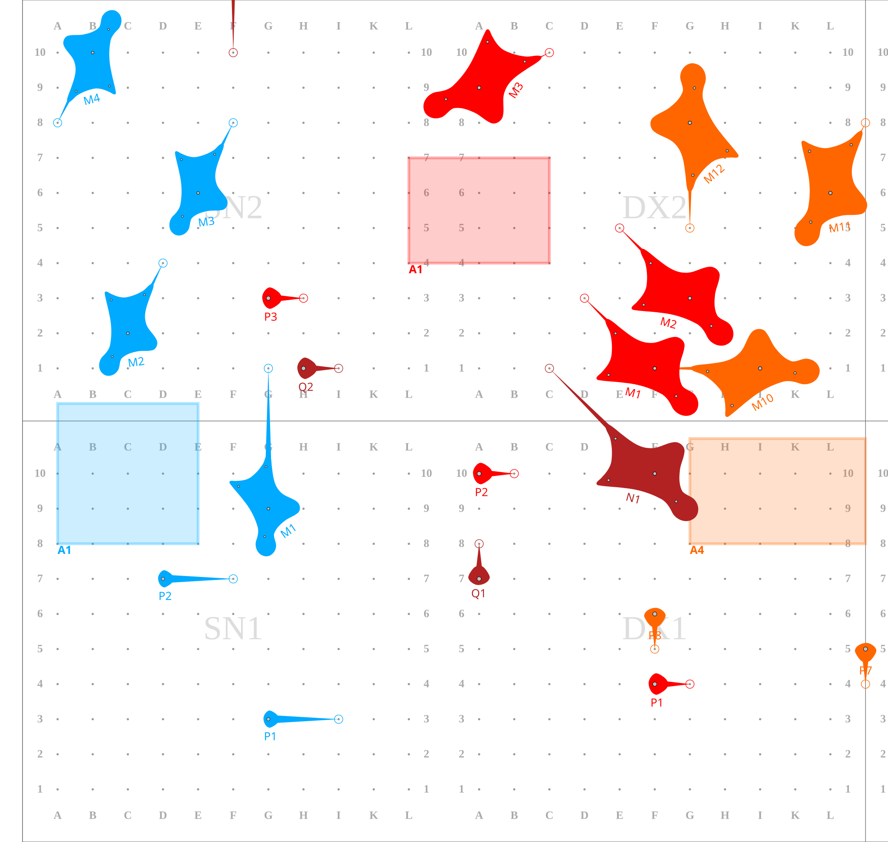

### Configuration with 2 full routes + end section

Both full U15 routes are on the wall, along with 2 full U11/U13 routes. Between the 2 lanes, the end section of the U15+ route is added.

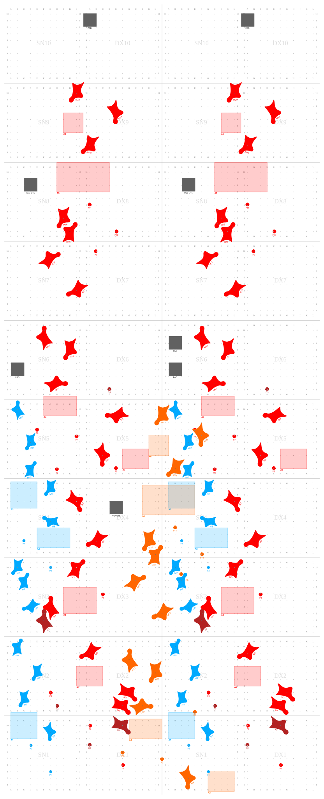

### Official IFSC route

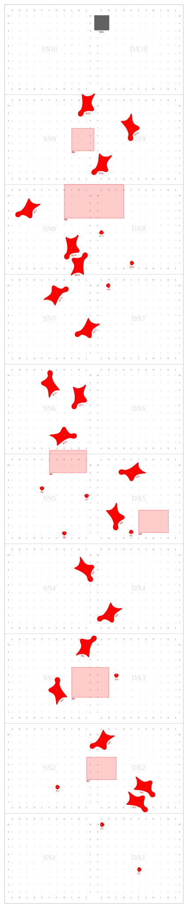

### U15 route (FFME)

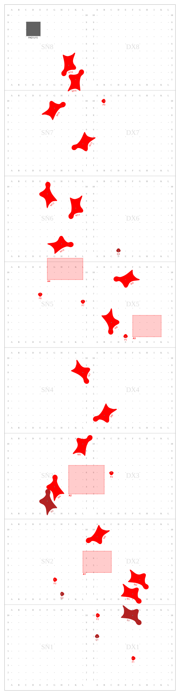

### U15 route (Austria/Germany/Canada/Switzerland)

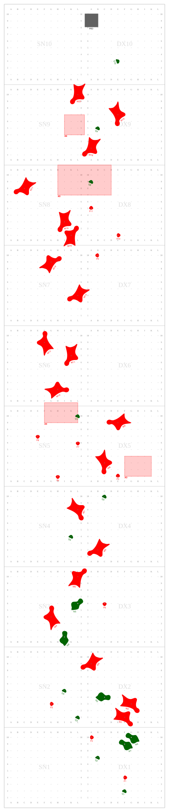

### U15 route (Italy - FASI)

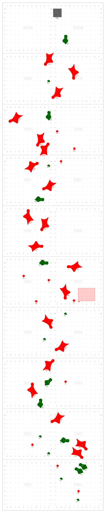

### U11-U13 route (FFME - training)

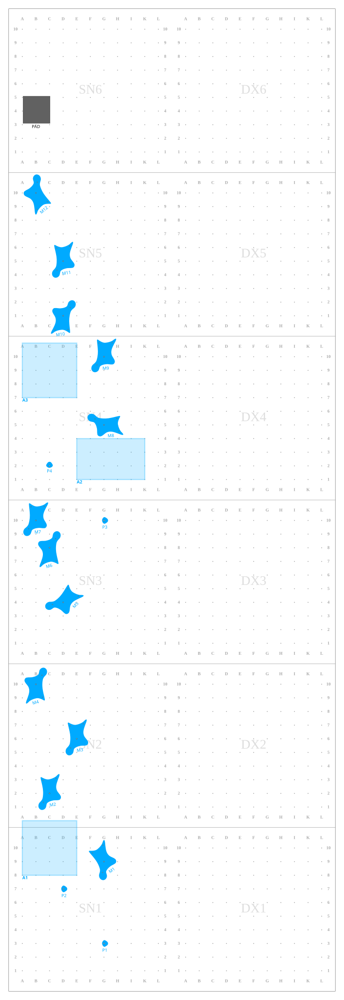

### U11-U13 route (FFME - competition)

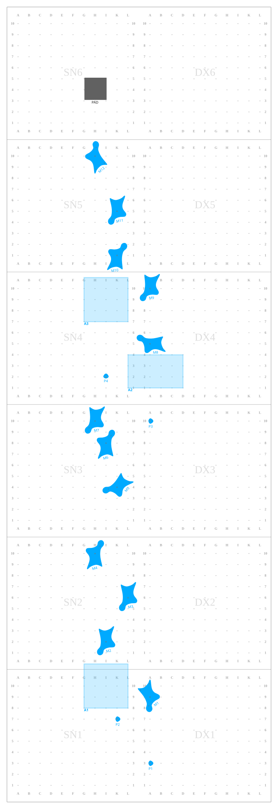

### U12-U14 route (FFME - training)

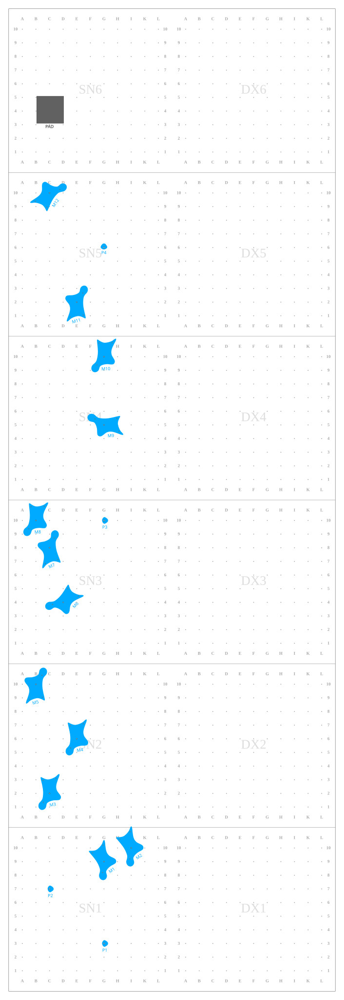

### U12-U14 route (FFME - competition)

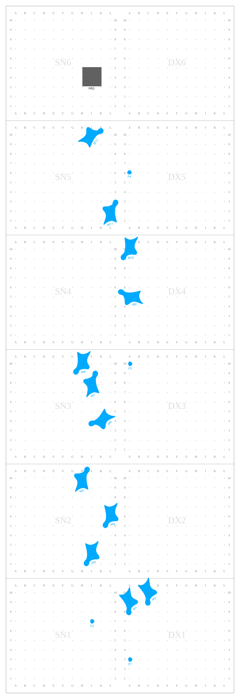

### U11-U13 route (Austria/Germany) - 10m

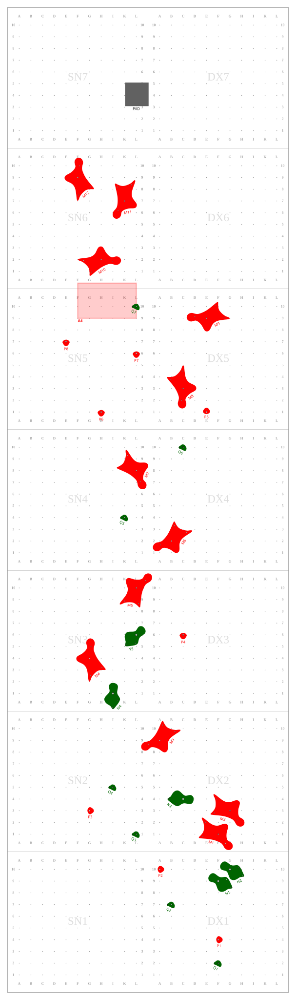

### U11-U13 route (Italy - FASI) - 10m

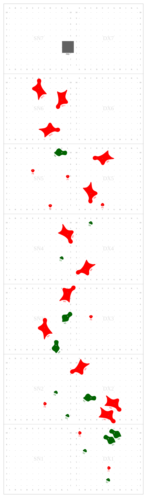

### U13 route (Canada/USA) - 10m

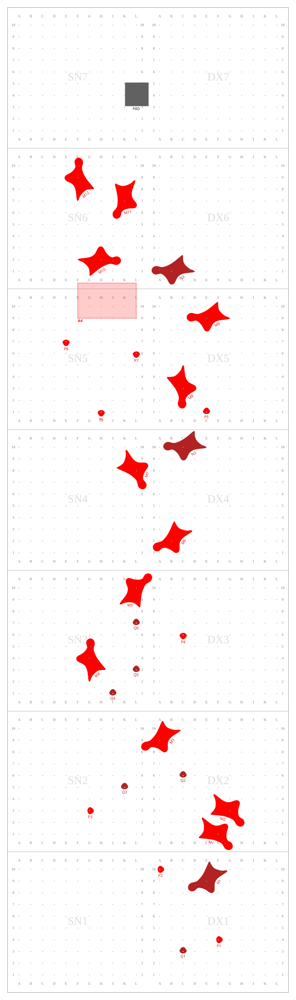

### U13-U15 route (India/AKCH) - 15m

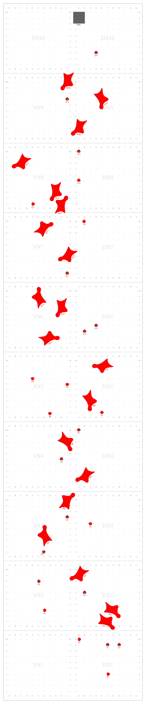

## Available reference routes

- `ifsc`: Official IFSC route — [official plan](docs/reference-routes/ifsc-speed-licence-rules-walls-2022-02-01.pdf)
- `u15`: U15 category (FFME) — [official plan](docs/reference-routes/ffme-u15-speed-route-2025-10-06.pdf)
- `u11-u13`: U11-U13 category (FFME - training) — [official plan](docs/reference-routes/ffme-u11-u13-speed-route-2025-12-12.pdf)
- `u11-u13-comp`: U11-U13 category (FFME - competition) — [official plan](docs/reference-routes/ffme-u11-u13-speed-route-2025-12-12.pdf)
- `u12-u14`: U12-U14 category (FFME - training) — [official plan](docs/reference-routes/ffme-u12-u14-speed-route-2024-10-16.pdf)
- `u12-u14-comp`: U12-U14 category (FFME - competition) — [official plan](docs/reference-routes/ffme-u12-u14-speed-route-2024-10-16.pdf)
- `u11-u13-de`: U11-U13 category (Austria/Germany) - 10m — [official plan](docs/reference-routes/germany-u11-u13-speed-route-2025.pdf)
- `u11-u13-it`: U11-U13 category (Italy - FASI) - 10m — [official plan](docs/reference-routes/fasi-regolamento-agonistico-giovanile-2026-v5.pdf)
- `u15-de`: U15 category (Austria/Germany/Canada/Switzerland) — [official plan](docs/reference-routes/germany-u15-speed-route-2025.pdf)
- `u15-it`: U15 category (Italy - FASI) — [official plan](docs/reference-routes/fasi-regolamento-agonistico-giovanile-2026-v5.pdf)
- `u13-u15-in`: U13-U15 category (India/AKCH) - 15m — [official plan](docs/reference-routes/india-imf-climbing-manual-2026.pdf)
- `u13-de`: U13 category (Canada/USA) - 10m — [official plan](docs/reference-routes/usa-u15-10m-speed-route-2024-11-20.pdf)
- `training`: Combined U15 and IFSC route

## Reference PDFs

Official route source PDFs are stored in [docs/reference-routes](docs/reference-routes/README.md).

## Development

### Installation

```bash
bun install
bun run build
```

### Run the web app in development mode

```bash
bun run dev:web
```

### Generate an SVG via CLI

```bash
bun run generate -- -c data/base.json -o output/wall.svg
```

Options:
- `-c, --config <path>`: JSON configuration file
- `-o, --output <path>`: Output SVG file

### JSON configuration

The configuration file defines:
- Wall dimensions (number of lanes, height in panels)
- Routes to display with their segments

Example:
```json
{
  "wall": {
    "lanes": 2,
    "panelsHeight": 10
  },
  "routes": [
    {
      "segments": [
        { "source": "ifsc", "color": "#FF0000" }
      ]
    }
  ]
}
```

## Project structure

```
├── packages/
│   ├── core/               # Core logic (SVG generation, composition)
│   └── cli/                # Command-line interface
├── web/                    # React web application
│   ├── src/
│   │   ├── components/     # React components
│   │   ├── hooks/          # Custom hooks
│   │   ├── store/          # State management (Zustand)
│   │   └── utils/          # Utilities
├── assets/holds/           # SVG files for different hold types
└── data/routes/            # Reference route definitions
```

## Hold format

Each hold is defined by:
- **Panel**: Panel identifier (e.g., `SN1`, `DX5`)
- **Type**: Hold type (`BIG`, `FOOT`, `STOP`, `PAD`)
- **Position**: Grid coordinates (e.g., `F10`, `C2`)
- **Orientation**: Arrow direction (e.g., `E2`, `DX2:C2`)

Example: `"DX1 BIG F10 DX2:C2 @N1"` places a BIG hold at F10 on DX1, oriented toward C2 on DX2, with label "N1".

## License

GPL-3.0
